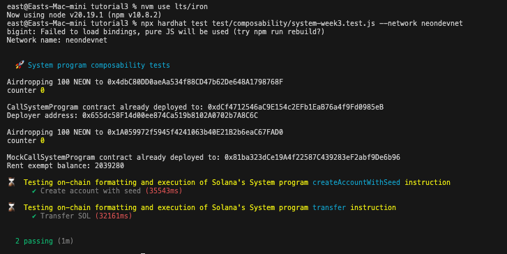
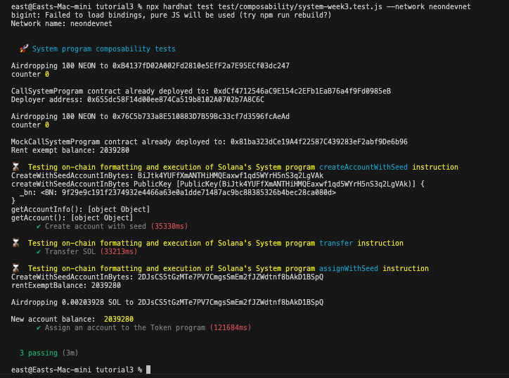
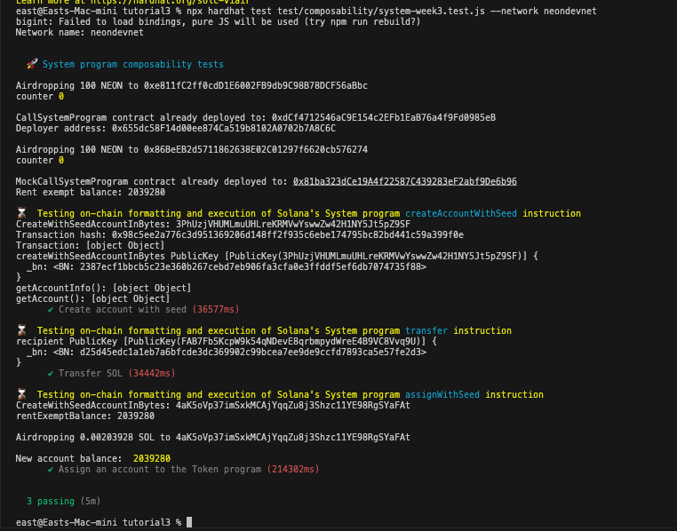

# Neon Bootcamp - Tutorial 3

This is the submission for the third installment in Neon's Bootcamp as originally described [here](https://bootcamp.neonevm.org/videos/system-program-library-how-to-use-it-why).

The objective of this tutorial is to be able to use the System Program Library (SPL). The SPL enables us to:
* Create Solana accounts from Solidity
* Transfer SOL between accounts
* Assign account ownership
* Allocate account storage
* Query Solana account metadata (owner, balance, executable flag, etc.)

In this tutorial, we aim to do the first of these items, specifically:
* Create Solana accounts from Solidity
* Transfer SOL between accounts

Similar to previous tutorials, we break this down into the following steps:

1. Setting up your local environment (installing required nodejs)
2. Cloning neon-tutorials repo
3. Modifying the deployment script
4. Acquiring (A LOT!) of test tokens


## Clone repository, switch to `dev/solidity-composability-libraries` branch

Run the following commands:

```sh
git clone git@github.com:eastmaels/nbc.git
cd nbc/tutorial3
```

**NOTE** From hereon, the succeeding commands needs to be run from the **nbc/tutorial3** directory.

## Install the required dependencies

```sh
npm install
```

## Setup Neon network in the Metamask wallet

We need a lot of test tokens (particularly, more than 2000 NEONS and SOL)!

1. Go to [[Neonpass](https://devnet.neonpass.live/)](https://devnet.neonpass.live/) .
2. Connect your EVM wallet and Solana wallets
3. Send SOL to your EVM wallet 

If you need test tokens:
* SOL: https://faucet.solana.com/
* NEON: https://neonfaucet.org/

## Set up .env file

Create a .env file in the root project folder and add these lines -

Although, I believe it won't be really necessary to create all of these many accounts since they won't be used in our program, I just completed all anyways.

```sh
PRIVATE_KEY_OWNER=<OWNER_PRIVATE_KEY>
PRIVATE_KEY_USER_1=<1ST_PRIVATE_KEY>
PRIVATE_KEY_USER_2=<2ND_PRIVATE_KEY>
PRIVATE_KEY_USER_3=<3RD_PRIVATE_KEY>
PRIVATE_KEY_SOLANA=<SOLANA_PRIVATE_KEY>
PRIVATE_KEY_SOLANA_2=<2ND_SOLANA_PRIVATE_KEY>
PRIVATE_KEY_SOLANA_3=<3RD_SOLANA_PRIVATE_KEY>
PRIVATE_KEY_SOLANA_4=<4TH_SOLANA_PRIVATE_KEY>
```

## Run the Deploy script

`npx hardhat test test/composability/system-week3.test.js --network neondevnet`


Note: I commented out the last test method because it fails to receive SOL airdrop.
For this test to succeed, I needed to manually send SOL to the account amounting to `rentExemptBalance`

## Results

1. `CallSystemProgram` Contract

[0xdCf4712546aC9E154c2EFb1EaB76a4f9Fd0985eB](https://neon-devnet.blockscout.com/address/0xdCf4712546aC9E154c2EFb1EaB76a4f9Fd0985eB)


2. `MockCallSystemProgram` Contract

[0x81ba323dCe19A4f22587C439283eF2abf9De6b96](https://neon-devnet.blockscout.com/address/0x81ba323dCe19A4f22587C439283eF2abf9De6b96)

3. `createAccountWithSeed` instruction

NEON Tx: [0x98c5ee2a776c3d951369206d148ff2f935c6ebe174795bc82bd441c59a399f0e](https://neon-devnet.blockscout.com/tx/0x98c5ee2a776c3d951369206d148ff2f935c6ebe174795bc82bd441c59a399f0e)
SOL account: [3PhUzjVHUMLmuUHLreKRMVwYswwZw42H1NY5Jt5pZ9SF](https://explorer.solana.com/address/3PhUzjVHUMLmuUHLreKRMVwYswwZw42H1NY5Jt5pZ9SF?cluster=devnet)

4. `transfer` instruction

SOL Recipient Account: [FAB7Fb5KcpW9k54qNDevE8qrbmpydWreE4B9VC8Vvq9U](https://explorer.solana.com/address/FAB7Fb5KcpW9k54qNDevE8qrbmpydWreE4B9VC8Vvq9U?cluster=devnet)
SOL Tx hash: [3Eaz5fYt7HFJKLqAVFgp7TCDmkrssNazuZ2RiL6TzUBS9cB3iaWQqxWyggpnneJipdbt9mJY2sK3zXz7hzEWa9Gi](https://explorer.solana.com/tx/3Eaz5fYt7HFJKLqAVFgp7TCDmkrssNazuZ2RiL6TzUBS9cB3iaWQqxWyggpnneJipdbt9mJY2sK3zXz7hzEWa9Gi?cluster=devnet)





