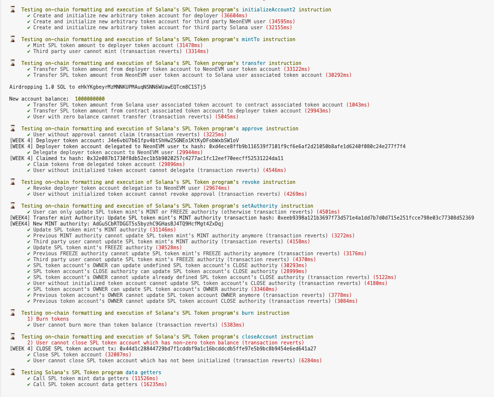

# Neon Bootcamp - Tutorial 4

This is the submission for the fourth installment in Neon's Bootcamp as originally described [here](https://bootcamp.neonevm.org/videos/spl-token-program-library-how-to-use-it-why).

The objective of this tutorial is to create and interact with an SPL token on Solana using Solidity.
* Initialize a new SPL token mint from a Solidity contract
* Create associated token accounts (ATAs)
* Mint, transfer, and burn tokens
* Understand how ATAs differ from arbitrary token accounts
* Use getter functions to read SPL token data

In this tutorial, we aim to do the first of these items, specifically:
* Create an SPL token mint with a new seed and mint tokens from the new mint to an associated token account.

Similar to previous tutorials, we break this down into the following steps:

1. Setting up your local environment (installing required nodejs)
2. Cloning neon-tutorials repo
3. Modifying the deployment script

## Clone repository

Run the following commands:

```sh
git clone git@github.com:eastmaels/nbc.git
cd nbc/tutorial4
```

**NOTE** From hereon, the succeeding commands needs to be run from the **nbc/tutorial4** directory.

## Install the required dependencies

```sh
npm install
```

## Setup Neon network in the Metamask wallet

1. Go to [[Neonpass](https://devnet.neonpass.live/)](https://devnet.neonpass.live/) .
2. Connect your EVM wallet and Solana wallets
3. Send SOL to your EVM wallet 

If you need test tokens:
* SOL: https://faucet.solana.com/
* NEON: https://neonfaucet.org/

## Set up .env file

Create a .env file in the root project folder and add these lines -

Although, I believe it won't be really necessary to create all of these many accounts since they won't be used in our program, I just completed all anyways.

```sh
PRIVATE_KEY_OWNER=<OWNER_PRIVATE_KEY>
PRIVATE_KEY_USER_1=<1ST_PRIVATE_KEY>
PRIVATE_KEY_USER_2=<2ND_PRIVATE_KEY>
PRIVATE_KEY_USER_3=<3RD_PRIVATE_KEY>
PRIVATE_KEY_SOLANA=<SOLANA_PRIVATE_KEY>
PRIVATE_KEY_SOLANA_2=<2ND_SOLANA_PRIVATE_KEY>
PRIVATE_KEY_SOLANA_3=<3RD_SOLANA_PRIVATE_KEY>
PRIVATE_KEY_SOLANA_4=<4TH_SOLANA_PRIVATE_KEY>
```

## Run the Deploy script

`npx hardhat test test/composability/spl-token-week4.test.js --network neondevnet`


## Results

### Contracts

1. `CallSystemProgram` Contract
    * NEON Contract: [0x801C0B35C6A00a42b04321096EF12B2461CdBbBd](https://neon-devnet.blockscout.com/address/0x801C0B35C6A00a42b04321096EF12B2461CdBbBd)

2. `CallSPLTokenProgram` Contract
    * NEON Contract: [0x2413A1ABE521EeF1Fb31dAac2ff40234d512e337](https://neon-devnet.blockscout.com/address/0x2413A1ABE521EeF1Fb31dAac2ff40234d512e337)


3. `CallAssociatedTokenProgram` Contract
    * NEON Contract: [0x69Db081873b9809d64942915653Af1A1F962EC2c](https://neon-devnet.blockscout.com/address/0x69Db081873b9809d64942915653Af1A1F962EC2c)


### Transactions

1. Create an SPL token mint with a new seed. `createInitializeTokenMint` instruction
    * NEON Tx: [0x5b6e4ca16e94c29dee7f6d31101a0c9a6222c7c44a7e2ba656ca29dd7ca9a56b](https://neon-devnet.blockscout.com/tx/0x5b6e4ca16e94c29dee7f6d31101a0c9a6222c7c44a7e2ba656ca29dd7ca9a56b)
    * SOL Token Mint account: [82zXntBF9msunhV1ViJXYbBYqcd4U3JDcTBicSA9YJjJ](https://explorer.solana.com/address/82zXntBF9msunhV1ViJXYbBYqcd4U3JDcTBicSA9YJjJ?cluster=devnet)

4. `transfer` instruction

    * SOL Recipient Account: [FAB7Fb5KcpW9k54qNDevE8qrbmpydWreE4B9VC8Vvq9U](https://explorer.solana.com/address/FAB7Fb5KcpW9k54qNDevE8qrbmpydWreE4B9VC8Vvq9U?cluster=devnet)
    * SOL Tx hash: [3Eaz5fYt7HFJKLqAVFgp7TCDmkrssNazuZ2RiL6TzUBS9cB3iaWQqxWyggpnneJipdbt9mJY2sK3zXz7hzEWa9Gi](https://explorer.solana.com/tx/3Eaz5fYt7HFJKLqAVFgp7TCDmkrssNazuZ2RiL6TzUBS9cB3iaWQqxWyggpnneJipdbt9mJY2sK3zXz7hzEWa9Gi?cluster=devnet)

## Run/s





```
east@Easts-Mac-mini tutorial4 % npx hardhat test test/composability/spl-token-week4.test.js --network neondevnet
Network name: neondevnet


  🚀 SPL Token program composability tests

Airdropping 100 NEON to 0x13b20c06610F13faFDF5252dC81f72FF22E3067d

Deployer address: 0x655dc58F14d00ee874Ca519b8102A0702b7A8C6C

Deployer balance: 49516.614778371494445737 NEON

Deploying CallSPLTokenProgram contract to neondevnet...

CallSPLTokenProgram contract deployed to: 0x2413A1ABE521EeF1Fb31dAac2ff40234d512e337

Airdropping 100 NEON to 0x37cC8fEa3E52d8f59D4a2aA772ceB7b3B9991f3F

Deployer address: 0x655dc58F14d00ee874Ca519b8102A0702b7A8C6C

Deployer balance: 49157.281018685081021329 NEON

Deploying CallSystemProgram contract to neondevnet...

CallSystemProgram contract deployed to: 0x801C0B35C6A00a42b04321096EF12B2461CdBbBd

Airdropping 100 NEON to 0xe1822b9e91d2Fe6cCB50ea47e02Fa3110DE47a8B

Deployer address: 0x655dc58F14d00ee874Ca519b8102A0702b7A8C6C

Deployer balance: 49009.185535328008478017 NEON

Deploying CallAssociatedTokenProgram contract to neondevnet...

CallAssociatedTokenProgram contract deployed to: 0x69Db081873b9809d64942915653Af1A1F962EC2c
    
⌛  Testing on-chain formatting and execution of Solana's SPL Token program's initializeMint2 instruction
[WEEk4] SPL token mint created tx hash: 0x5b6e4ca16e94c29dee7f6d31101a0c9a6222c7c44a7e2ba656ca29dd7ca9a56b
[WEEk4] token mint account: 0x6884708e0eba127a4f5b6e436e0a987b98955e4908948131dddf59a6592d97b1
      ✔ Create and initialize new SPL token mint (33395ms)
    
⌛  Testing on-chain formatting and execution of Solana's Associated Token program's create instruction
[WEEK 4] Solana User Public Key Owner of token: eHkYKgbeyrMzMNNKUPMAuqNSNN6WUawEQTcm8C1STj5
[WEEK 4] Associated token account created tx hash: 0xd6927903184f2b5b8c22239d1ed16ba55c92a63ec36b4fcdcc242ca9030c59ee
      ✔ Create and initialize new associated token account for third party Solana user (35910ms)
      ✔ Create and initialize new associated token account for CallAssociatedTokenProgram contract (35735ms)
    
⌛  Testing on-chain formatting and execution of Solana's SPL Token program's initializeAccount2 instruction
      ✔ Create and initialize new arbitrary token account for deployer (36604ms)
      ✔ Create and initialize new arbitrary token account for third party NeonEVM user (34595ms)
      ✔ Create and initialize new arbitrary token account for third party Solana user (32155ms)
    
⌛  Testing on-chain formatting and execution of Solana's SPL Token program's mintTo instruction
      ✔ Mint SPL token amount to deployer token account (31478ms)
      ✔ Third party user cannot mint (transaction reverts) (3314ms)
    
⌛  Testing on-chain formatting and execution of Solana's SPL Token program's transfer instruction
      ✔ Transfer SPL token amount from deployer token account to NeonEVM user token account (33122ms)
      ✔ Transfer SPL token amount from NeonEVM user token account to Solana user associated token account (30292ms)

Airdropping 1.0 SOL to eHkYKgbeyrMzMNNKUPMAuqNSNN6WUawEQTcm8C1STj5

New account balance:  1000000000
      ✔ Transfer SPL token amount from Solana user associated token account to contract associated token account (1043ms)
      ✔ Transfer SPL token amount from contract associated token account to deployer token account (29943ms)
      ✔ User with zero balance cannot transfer (transaction reverts) (5045ms)
    
⌛  Testing on-chain formatting and execution of Solana's SPL Token program's approve instruction
      ✔ User without approval cannot claim (transaction reverts) (3225ms)
[WEEK 4] Deployer token account: J4e6vbU7b61fpv4btShHw25GNEo1KtKyDFobWxbSW1oV
[WEEK 4] Deployer token account delegated to NeonEVM user tx hash: 0xd4ece8ffb9b116539f7101f9cf6e6af2d21050b8afe1d6240f080c24e277f7f4
      ✔ Delegate deployer token account to NeonEVM user (29944ms)
[WEEK 4] Claimed tx hash: 0x32e087b1730f8db52ec1b5b9020257c4277ac1fc12eef70eecff52531224da11
      ✔ Claim tokens from delegated token account (29896ms)
      ✔ User without initialized token account cannot delegate (transaction reverts) (4546ms)
    
⌛  Testing on-chain formatting and execution of Solana's SPL Token program's revoke instruction
      ✔ Revoke deployer token account delegation to NeonEVM user (29674ms)
      ✔ User without initialized token account cannot revoke approval (transaction reverts) (4269ms)
    
⌛  Testing on-chain formatting and execution of Solana's SPL Token program's setAuthority instruction
      ✔ User can only update SPL token mint's MINT or FREEZE authority (otherwise transaction reverts) (4501ms)
[WEEK4] Transfer mint Authority: Update SPL token mint's MINT authority transaction hash: 0xeeb9398a121b3697f73d571e4a1dd7b7d0d715e251fcce798e03c77308d52369
[WEEK4] New MINT authority: AdGuSCbRTDGGT5s5byzhC9GHasBJ4TQ9HcfMgt4ZxDqj
      ✔ Update SPL token mint's MINT authority (31146ms)
      ✔ Previous MINT authority cannot update SPL token mint's MINT authority anymore (transaction reverts) (3272ms)
      ✔ Third party user cannot update SPL token mint's MINT authority (transaction reverts) (4158ms)
      ✔ Update SPL token mint's FREEZE authority (30528ms)
      ✔ Previous FREEZE authority cannot update SPL token mint's FREEZE authority anymore (transaction reverts) (3176ms)
      ✔ Third party user cannot update SPL token mint's FREEZE authority (transaction reverts) (4370ms)
      ✔ SPL token account's OWNER can update undefined SPL token account's CLOSE authority (30293ms)
      ✔ SPL token account's CLOSE authority can update SPL token account's CLOSE authority (28999ms)
      ✔ SPL token account's OWNER cannot update already defined SPL token account's CLOSE authority (transaction reverts) (5122ms)
      ✔ User without initialized token account cannot update SPL token account's CLOSE authority (transaction reverts) (4180ms)
      ✔ SPL token account's OWNER can update SPL token account's OWNER authority (33460ms)
      ✔ Previous token account's OWNER cannot update SPL token account OWNER anymore (transaction reverts) (3778ms)
      ✔ Previous token account's OWNER cannot update SPL token account CLOSE authority (transaction reverts) (3084ms)
    
⌛  Testing on-chain formatting and execution of Solana's SPL Token program's burn instruction
      1) Burn tokens
      ✔ User cannot burn more than token balance (transaction reverts) (5383ms)
    
⌛  Testing on-chain formatting and execution of Solana's SPL Token program's closeAccount instruction
      2) User cannot close SPL token account which has non-zero token balance (transaction reverts)
[WEEK 4] CLOSE SPL token account tx: 0x44d1c28844729bd7f1cddbf9a1c16bcddcdb5ffe97e5b9bc8b9454e6ed641a27
      ✔ Close SPL token account (32087ms)
      ✔ User cannot close SPL token account which has not been initialized (transaction reverts) (6284ms)
    
⌛  Testing Solana's SPL Token program data getters
      ✔ Call SPL token mint data getters (11526ms)
      ✔ Call SPL token account data getters (16235ms)
```