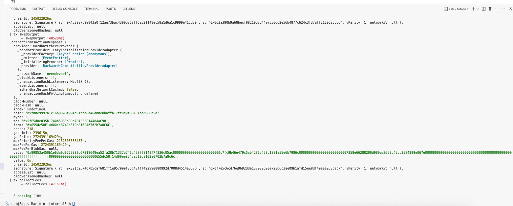

# Neon Bootcamp - Tutorial 5

I mainly focused on the [ETH Belgrade Hackathon 3](https://taikai.network/ethbelgrade/hackathons/eth-belgrade-hackathon-3) joining the NEON Taikai category.
The project I submitted was [Neon ERC20 To SPL Token Launcher](https://taikai.network/ethbelgrade/hackathons/eth-belgrade-hackathon-3/projects/cmbiodzax00a7pppcxl64oc07/idea), which fortunately received an [honorable mention](https://www.neonevm.org/blog/proof-of-conference-neon-at-eth-belgrade).

Anyway, moving to the task at hand. [Bootcamp #5](https://bootcamp.neonevm.org/videos/raydium-program-library-your-go-to-tool-for-de-fi-use-cases) is all about Raydium program library.
Although I personally don't have personal experience in using Radium that often (I may have used it already, but I'm just not aware that it's Radium I'm using).

Anyhows, the video tutorial/post starts with a comparision of Raydium vs Uniswap and gave a table of the key differences of the two.
I'm not an expert with DEX, so I'll just jump in to the Week5's task which basically assigns us to do the following tasks:

* Run the test script to see how a Raydium pool is created and used
* Then, think of a potential DeFi use case for this functionality
* In your README.md, describe your idea clearly — what the dApp would do and how it would use the Raydium instructions


## Clone repository

Run the following commands:

```sh
git clone git@github.com:eastmaels/nbc.git
cd nbc/tutorial5
```

**NOTE** From hereon, the succeeding commands needs to be run from the **nbc/tutorial4** directory.

## Install the required dependencies

```sh
npm install
```

## Setup Neon network in the Metamask wallet

1. Go to [[Neonpass](https://devnet.neonpass.live/)](https://devnet.neonpass.live/) .
2. Connect your EVM wallet and Solana wallets
3. Send SOL to your EVM wallet 

If you need test tokens:
* SOL: https://faucet.solana.com/
* NEON: https://neonfaucet.org/

## Set up .env file

Create a .env file in the root project folder and add these lines -

Although, I believe it won't be really necessary to create all of these many accounts since they won't be used in our program, I just completed all anyways.

```sh
PRIVATE_KEY_OWNER=<OWNER_PRIVATE_KEY>
PRIVATE_KEY_USER_1=<1ST_PRIVATE_KEY>
PRIVATE_KEY_USER_2=<2ND_PRIVATE_KEY>
PRIVATE_KEY_USER_3=<3RD_PRIVATE_KEY>
PRIVATE_KEY_SOLANA=<SOLANA_PRIVATE_KEY>
PRIVATE_KEY_SOLANA_2=<2ND_SOLANA_PRIVATE_KEY>
PRIVATE_KEY_SOLANA_3=<3RD_SOLANA_PRIVATE_KEY>
PRIVATE_KEY_SOLANA_4=<4TH_SOLANA_PRIVATE_KEY>
```

## Run the Deploy script

`npx hardhat test test/composability/raydium-week5.test.js --network neondevnet`


## IDEA: Potential DeFi Use Case

The main use case I can think of in regards to adding liquidity pools in DEXes is basically when you launch your own token.
The people that compose your community, you give them a portion of your tokens, and then you give them the freedom to swap it to other tokens they want to exchange it with.
Particularly I guess is converting your token to SOL. 

## Results

## Run/s
